# 🏒 NHL Slowly Changing Dimensions

### A Production Grade NHL Data Engineering Pipeline

---

## Overview

This project builds a modern analytics pipeline around the NHL's public roster API.

Rather than simply downloading today's roster, the pipeline captures historical snapshots, detects roster changes, stores immutable bronze data, and builds a dimensional warehouse using **Slowly Changing Dimension (Type 2)** modeling.

## What It Solves

| Problem | Solution |
|---------|----------|
| "Who was on the roster on opening night?" | Point in time queries via SCD2 |
| "When did a player switch numbers" | Full player history tracking |
| "How many players has Chicago used this season?" | Historical roster counts |
| "Are we wasting storage on unchanged rosters?" | Hash based change detection |

## 🚀 Key Features

| Feature | Why It Matters |
|---------|----------------|
| **✅ Hash-based change detection** | Skip unchanged rosters → save storage & time |
| **✅ Immutable bronze snapshots** | Complete audit trail, never overwrite |
| **✅ DuckDB warehouse** | Embedded analytics, zero infrastructure |
| **✅ SCD Type 2 modeling** | Full player history (team, number, position) |
| **✅ dbt tests** | 12 tests ensuring data quality |
| **✅ Idempotent pipeline** | Safe to run daily, no duplicate data |

## Pipeline Breakdown

```mermaid
flowchart LR
    A[<b>🏒 NHL API</b><br/>Roster Data]:::api --> B
    
    B[<b>📡 Fetch Team Rosters</b><br/>32 teams in sequence]:::fetch
    
    B --> C{<b>🧮 Has roster</b><br/><b>changed?</b>}:::decision
    
    C -- No<br/><small>hash matches</small> --> D[<b>⏭️ Skip</b><br/>No duplicate work]:::skip
    
    C -- Yes<br/><small>hash differs</small> --> E[<b>💾 Save Snapshot</b><br/>Parquet + JSON + metadata]:::write
    
    E --> F[<b>🗄️ Load to DuckDB</b><br/>Append to raw_rosters]:::load
    
    F --> G[<b>📝 Update State</b><br/>Store new hash]:::state
    
    G --> H[<b>✅ Ready for Analysis</b><br/>dbt models]:::ready
    
    D --> H
    
    H --> I[<b>🏁 All 32 Teams</b><br/>Processed]:::done
    
    classDef api fill:#4A90D9,color:#fff,stroke:#2C5F8A,stroke-width:2px
    classDef fetch fill:#50C878,color:#fff,stroke:#2E8B57,stroke-width:2px
    classDef decision fill:#FFD700,color:#333,stroke:#DAA520,stroke-width:2px
    classDef skip fill:#D3D3D3,color:#333,stroke:#999,stroke-width:2px
    classDef write fill:#FF6B6B,color:#fff,stroke:#C0392B,stroke-width:2px
    classDef load fill:#9B59B6,color:#fff,stroke:#7D3C98,stroke-width:2px
    classDef state fill:#F39C12,color:#fff,stroke:#E67E22,stroke-width:2px
    classDef ready fill:#2ECC71,color:#fff,stroke:#27AE60,stroke-width:2px
    classDef done fill:#1ABC9C,color:#fff,stroke:#16A085,stroke-width:2px
```

run_pipeline.py kicks off the entire process by telling roster_api.py to scrape all 32 NHL teams. For each team, client.py handles the heavy lifting fetching the JSON roster data from the NHL API with automatic retries if anything fails.

Once the raw JSON arrives, roster_api.py transforms it into a clean list of player records. Then state_manager.py steps in: it computes a unique hash of the roster and checks DuckDB for the previous version. If the hashes match, nothing has changed, so it skips the team entirely. If they differ, that means the roster has updated.

When a change is detected, bronze.py writes an immutable snapshot as Parquet + JSON to a folder organized by season and team. duckdb_loader.py appends the new data to raw_rosters, and state_manager.py updates the stored hash for future comparisons. This cycle repeats for all 32 teams, leaving you with a complete, auditable historical record of every roster change.

| Module | What It Does | Key Decision |
|--------|-------------|--------------|
| `client.py` | Generic HTTP client with retries, timeouts, and session management | Exponential backoff (2^attempt) for transient failures; single `_get()` method reused across all endpoints |
| `roster_api.py` | Orchestrates full pipeline: fetch → parse → bronze → DuckDB → state | `scrape_and_load_all_teams()` is the single entry point; calls every module in sequence |
| `state_manager.py` | Computes MD5 roster hash, checks DuckDB for previous hash, updates state | Hash-based change detection determines if bronze write is needed; state lives in DuckDB (not Parquet) |
| `bronze.py` | Writes immutable Parquet snapshots + JSON + metadata; handles change detection | Partitioned storage `season=YYYY/team=XXX/run_*.parquet`; skips write if `force=False` and hash matches |
| `duckdb_loader.py` | Appends roster data to `raw_rosters` table; manages schema initialization | Append-only loading; indexes on `team`, `season`, `run_id`, `player_id` |
| `config.py` | Auto detects NHL season (2025 → 20252026); manages all paths | Season detection logic: July–September = previous season, October–June = current season |
| `logging.py` | Structured logging with timestamps, levels, and file output | All modules share same logger; logs written to `data/logs/` |

## DuckDB Tables
| Table | Purpose | Updated When |
|---------|----------------|----|
| raw_rosters | Append only historical data |Every time load_roster() is called |
| roster_state | Current hash per team |After each team is processed |
| roster_changes_log | Audit trail of changes |Optional (called by log_change()) |
| main_marts.dim_team | Team dimension |dbt run |
| main_marts.dim_player | SCD Type 2 player history |dbt run |

